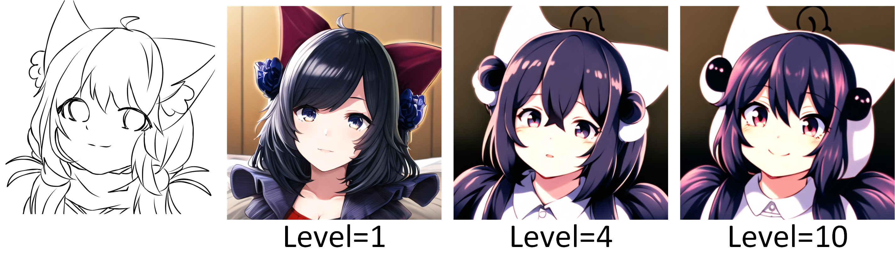
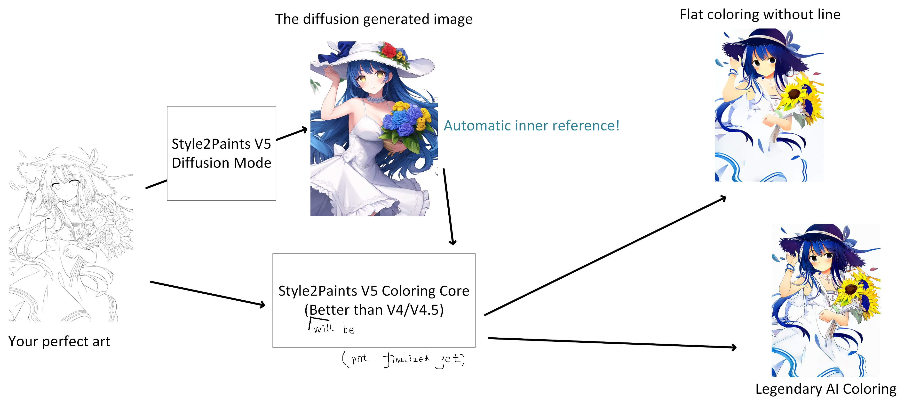

# Style2Paints V5.0.0.1a Preview

Style2Paints V5 is an ultra large tag-based **sketch-to-illustration** diffusion model. The number of model parameters is 1.42 times larger than Stable Diffusion V2. [1]

The training data comes from two domain: 50% are [Gwern](https://www.gwern.net/)’s Danbooru dataset (washed by many metrics), and 50% are research materials from Style2Paints Research (collected in 7 years from 2016 to 2023). Line drawings are generated by many different methods as data augmentation. Each line-drawing-and-illustration pair has a weighted possibility to be included in each random training batch. Highly frequent unique samples are about 1M, Lowly frequent unique samples are about 7M. All state-of-the-art tricks are applied, like some data augmentations and aspect ratio bucketing.

The model is not trained from scratch. The initial weight comes from three sources: (1) some layers are initialized with borrowed weights from a wild mixture of many stable diffusion models, and we manually picked some best layers from many models [2], during many experiments. (2) some layers are initialized from scratch. (3) some layer weights are manually written by Lvmin, typically some special connection layers.

The architecture is not a U-net. It is more like a W-net since we also use an encoder for sketch input. Our original intention is to train a sketch encoder that can encode any sketch into some feature maps that can be interpreted by some certain layers of SD, but as this super large model being trained with many skip connections, now we are not sure about the exact functionality of the very large sketch encoder. 

The model is trained with 2TB GPU memory. We will release a technical report in two or three weeks. The model and code will be 100% open-sourced. 

The model is trained by [Lvmin Zhang](https://lllyasviel.github.io/Style2PaintsResearch/lvmin).

[1] The extra parameters are mainly in the encoding layers of the input sketch, not in the image generating layers. Nevertheless, since we actively use skip connections, it seems that all layers work together as a whole. If that is true, the model *may* be more powerful than SD but we have no evidence to say that. FID and CLIP scores are not well-suited for illustrations.

[2] We thank [Linaqruf](https://huggingface.co/Linaqruf) for providing Anything V3. Many initial weights are from this pretty model.

# Discussion Thread

[Here](https://github.com/lllyasviel/style2paints/issues/205) is a discussion thread.

# From Sketch To Illustrations

In this result, the left-top is the input line drawing (created by Lvmin). All other images are outputs.

All images use the same default prompt.

    1girl, masterpiece, best quality, ultra-detailed, illustration, disheveled hair

This prompt can be used in any illustrations as a default start. We do not know who first proposed it but everyone is using it.

The independent results are different because and only because their initial random noise is different.

In this result, the left-top is the input line drawing (created by Lvmin). All other images are outputs. All images use the same default prompt.

# Recognition of Sketch Content

This interesting case shows that how the model will recognize the line drawing. This line drawing can be seen either as a girl facing us or as a girl with her back to us. The model can handle both case. Interesting! All images use the same default prompt.

# Processing Unfinished Sketch

Your sketch does not need to be finished. You can draw a part of your wanted thing. The model can just complete it.

# Controlling the Confidence of Sketch

We provide different levels of control. But we also emphasize that the absolute control is super difficult. The model tends to rebel violently when it disagrees with your decision.

For example, in the case below, the collar was never controlled to follow the appearance of that in the line drawing. This is a limitation of the model. We are trying to improve it.

# Start to Use Prompts

Many people in the old days did not like to use prompt in their visual work. in our model, the user can of course not use prompt and focus only on the visual elements inside the line art. But if you try prompt you will find that it is indeed a good tool.

# Supporting Color Scribbles

This section is under construction. Please come back tomorrow.

# Workflow-Oriented Assistant

We will continue to assist the workflow of artists. The new pipeline will use a costumed model to generate ‘inner’ references that artists may or may not need to see. The workflow-oriented considerations will be preserved and continue to develop in V5.

We were and will be the friend of artists forever. Some other groups may be AI-centric. But we are 100% human-centric. You can totally trust us in this point.

The new pipeline is roughly visualized as this:

! note that this image is only for a quick preview - after we finalize this part, the results will look better !

This inner-reference-based legendary coloring part is a relatively easy component from a technical perspective (Controlling diffusion with sketches is much more difficult). We will put this part in higher priority after seeing great feedbacks of all of you.

We spent most time and efforts in controlling diffusion models using sketches and seems to have underestimated the importance of this part (after seeing many artist feedbacks). Our next step will be finishing this part first.

Q: What if I already have a reference image? 

A: The 'inner' reference is a generated reference that is *almost aligned* with the line drawing. It will be used by the model in a different way than 'outside' references, which, in most cases, have arbitrary shapes. In most cases, you will not even see the 'inner' references (style2paints V3/V4 already use many techniques that are similar to inner references). You will still be able to provide outside references just like previous versions.

# Citation

If you want to mention us:

    @misc{s2pv5,
      author  = {Lvmin Zhang},
      title   = {Style2Paints V5},
      year    = {2023},
    }

Note that we will soon have model and tech report publicly available.

# Contact

The exact way of releasing the model is still in heated discussion in Style2Paints Research.

We want to hear voice from both technical world and artists, especially all thoughtful consideration of AI ethics and copyright.

If you want to influence the decision making, feel free to message in [this issue](https://github.com/lllyasviel/style2paints/issues/205).

# 中文社区

我们有一个除了技术什么东西都聊的以技术交流为主的群: 816096787。
